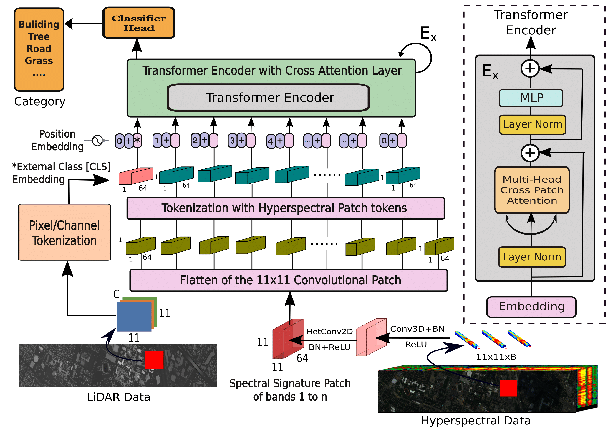

# Multimodal Fusion Transformer for Remote Sensing Image Classification

[Swalpa Kumar Roy](https://swalpa.github.io), [Ankur Deria](), [Danfeng Hong](https://sites.google.com/view/danfeng-hong), [Behnood Rasti](https://scholar.google.com/citations?user=hA_Xi6MAAAAJ&hl=en), [Antonio Plaza](https://scholar.google.com/citations?user=F1UAj8oAAAAJ&hl=en), and [Jocelyn Chanussot](http://jocelyn-chanussot.net/)

___________

The repository contains the implementations for [Multimodal Fusion Transformer for Remote Sensing Image Classification](https://www.researchgate.net/publication/359647022_Multimodal_Fusion_Transformer_for_Remote_Sensing_Image_Classification).

---------------------
### Dataset

* **Muffle** was collected over the campus of Southern Mississippi-Gulfpark. The original image has 325 × 220 pixels and 64 bands in the spectral range from 0.375 to 1.050 μm. We select a popular region of interest (ROI) with a size of 130 × 90 pixels

## Models

The following traditional machine learning methods will be available:

- [x] [RF](https://ieeexplore.ieee.org/document/1396322) 
- [x] [SVM](https://ieeexplore.ieee.org/document/1323134) 
- [x] [RNN](https://ieeexplore.ieee.org/document/8662780)
- [x] [KNN](https://ieeexplore.ieee.org/document/9065747) 

The following deep learning methods will be available:

- [x] [CNN-1D](https://www.sciencedirect.com/science/article/pii/S0924271619302187)
- [x] [CNN-2D](https://ieeexplore.ieee.org/document/7326945)
- [x] [CNN-3D](https://ieeexplore.ieee.org/document/8344565)

The following transformer based deep learning methods will be available:

- [x] [ViT](https://paperswithcode.com/paper/an-image-is-worth-16x16-words-transformers-1)
- [x] [SpectralFormer](https://ieeexplore.ieee.org/document/9627165)
- [x] [MFT](https://www.researchgate.net/publication/359647022_Multimodal_Fusion_Transformer_for_Remote_Sensing_Image_Classification)

<strong>New!!</strong> Code will be available here soon.
